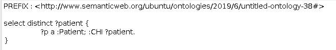
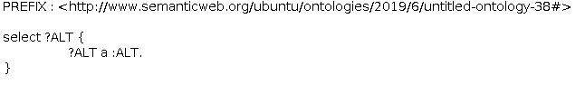

# Evaluation
Our benchmark consists of the data sets setup, queries and the environment setup for evaluation. Various SPARQL query benchmarks have been proposed in the Semantic Web community. However, they are mostly designed and used to evaluate the deficiencies of RDF triple stores. In this project, we are more focused on the consistency and completeness in federated query-answering as the motivation is to answer clinical questions where these two aspects are essential. Therefore, a benchmark capable of examining the correctness and completeness of the querying results using our framework was designed. To formalise the process, benchmark queries for specific requirements stated earlier are designed. For examination, correctness is mainly proved by using ontology to check inconsistency, while completeness is proved both in inconsistency handling and domain knowledge inference.

Since RDF is generally limited by open-world assumption, meaning information is incomplete by default, complete querying results cannot be achieved with certainty. Therefore, we did not concentrate on completeness regarding to all aspects of federated querying, but aimed at aspects in the context of how much various conditions it could handle. For example, the framework provided can not only give records of one specific test, but also suggest similar tests of the specific test. Additionally, different constraints could be handled in the framework, which also contributes to the provenance of completeness.

## Benchmark Setup
### Data Sets
To preserve privacy, benchmarks in health care often use synthetic data and different types of synthetic data generators for medical research are employed. Many relevant tools are avoided, such as Mockaroo, SQL Data Generator, BadMedicine were utilised for our project, since it uses models generated from live Electronic Health Records (EHR) data sets in Scotland, which makes the generated data recognisable from a clinical perspective and representative enough to model potential problems that would take place in real data. 3 essential data sets including Biochemistry, Prescribing and Hospital Admission are generated to mimic the real-world data repositories of SCI store, PIS and SMR01 respectively. The Biochemistry data contains information about patients’ chi number, patients’ sample type, date when the sample is given, tests and their result, which are associated with the use case. The Prescribing data includes the medications used by patients and when these drugs were prescribed. And the Hospital Admission data shows the patients’ medical conditions (diagnosis), which is crucial to determine whether a drug can be used by these patients. Each of these data sets consists of 300 records of 100 patients, which is automatically generated by BadMedicine.

While different sets of data consisting of these 3 data sets could be generated and loaded to different port to model the real federated querying procedure theoretically, data will be integrated on one port since SHRINE is responsible for integrating data together.

### Environment Setup
The framework is realised on a virtual machine to make it convenient for further exploration when more approaches are adapted. Fundamental information is shown below:

|        | RAM    |VCPUs  | Disk  |
| -------|:------:|:-----:| -----:|
| Value  | 16GB   | 8VCPU | 160G  |

## Performance Measure
In the project, the objectives of deploying an ontology for data access are a) to handle data-level inconsistency and b) to perform knowledge-level query inference, which lead to 2 slight different methods for the evaluation.

Whether requirements of data-level inconsistency handling were met was examined by comparisons with results of MySQL queries. In the experiments, 3 types of queries were used as follows:

   1. The queries (the SPARQL queries, the DL queries or their combination) used in our framework are called Test Queries.  

   2. The MySQL queries syntactic equivalent to the Test Queries are called Plain SQL Queries.  

   3. The MySQL queries trying to meet the requirement using complex syntax are called Complex SQL Queries.  

On the other hand, the examination of whether requirements of query inference are met uses 2 types of queries. One is Test Query stated earlier, and the other one is a complicated MySQL query customised to the use case problem, which is called Customised Query (similar to the Complex SQL Query).

For measurement, the main metric adopted is the result size. To formalise the result size, numbers of results and numbers of inconsistent results will be given for inconsistency handling.

Since there is no certain criteria for correct and complete data, a constant number a will be given as the number of inconsistent results for the Test Query in examination of each requirement. For instance, if there are 5 more inconsistent results for the Plain SQL Query than for the Test Query, the number of inconsistent result for Plain SQL Query is denoted as 
. 

Similarly, numbers of results and numbers of inconsistency will be collected for examination of domain knowledge inference. However, there may be requirements cannot be handled with the SQL queries (Complex SQL Queries or Customised Queries). Under such circumstance, only Test Queries and their number of results will be involved in the evaluation.

### Queries for Data-Level Inconsistency handling

> **_Request 1_** The requirement of consistency checking needs our approach to fill absence of data according to its inner constraints. This contributes to a request, that give all patients in given data source, including those who use drugs but not declared to be patients.

  * The SPARQL query work as **Test Query** is:



The **Plain SQL Query** is:
```
SELECT DISTINCT CHI FROM lab_abdn;
```
Although inference using relations of classes could not be realised in MySQL since no hierarchical information is contained in databases, little tricks (```OUTER JOINT``` and ```UNION```) can be used to query for all distince patients specifically for Request 1. In the given data, information of health board and which drugs used by patients are stored seperately in different tables. However, since full outer joint is not supported in MySQL, ```UNION``` are adapted. The **Complex SQL Query** is as follows:
```
SELECT DISTINCT CHI FROM lab_abdn UNION SELECT
DISTINCT CHI FROM Prescription;
```

> **_Request 2_** The requirement of handling inconsistent data also needs the framework to make assumptions according to properties of super class relations. Another request is get all ALT tests, while there is test only declared to be 44GB test, which is sub class of the ALT test.

  * The SPARQL query works as **Test Query** is:
  
  
