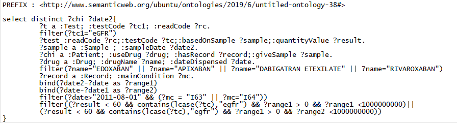

# Evaluation
Our benchmark consists of the data sets setup, queries and the environment setup for evaluation. Various SPARQL query benchmarks have been proposed in the Semantic Web community. However, they are mostly designed and used to evaluate the deficiencies of RDF triple stores. In this project, we are more focused on the consistency and completeness in federated query-answering as the motivation is to answer clinical questions where these two aspects are essential. Therefore, a benchmark capable of examining the correctness and completeness of the querying results using our framework was designed. To formalise the process, benchmark queries for specific requirements stated earlier are designed. For examination, correctness is mainly proved by using ontology to check inconsistency, while completeness is proved both in inconsistency handling and domain knowledge inference.

Since RDF is generally limited by open-world assumption, meaning information is incomplete by default, complete querying results cannot be achieved with certainty. Therefore, we did not concentrate on completeness regarding to all aspects of federated querying, but aimed at aspects in the context of how much various conditions it could handle. For example, the framework provided can not only give records of one specific test, but also suggest similar tests of the specific test. Additionally, different constraints could be handled in the framework, which also contributes to the provenance of completeness.

## Benchmark Setup
### Data Sets
To preserve privacy, benchmarks in health care often use synthetic data and different types of synthetic data generators for medical research are employed. Many relevant tools are avoided, such as Mockaroo, SQL Data Generator, BadMedicine were utilised for our project, since it uses models generated from live Electronic Health Records (EHR) data sets in Scotland, which makes the generated data recognisable from a clinical perspective and representative enough to model potential problems that would take place in real data. 3 essential data sets including Biochemistry, Prescribing and Hospital Admission are generated to mimic the real-world data repositories of SCI store, PIS and SMR01 respectively. The Biochemistry data contains information about patients’ chi number, patients’ sample type, date when the sample is given, tests and their result, which are associated with the use case. The Prescribing data includes the medications used by patients and when these drugs were prescribed. And the Hospital Admission data shows the patients’ medical conditions (diagnosis), which is crucial to determine whether a drug can be used by these patients. Each of these data sets consists of 300 records of 100 patients, which is automatically generated by BadMedicine.

While different sets of data consisting of these 3 data sets could be generated and loaded to different port to model the real federated querying procedure theoretically, data will be integrated on one port since SHRINE is responsible for integrating data together.

### Environment Setup
The framework is realised on a virtual machine to make it convenient for further exploration when more approaches are adapted. Fundamental information is shown below:

|        | RAM    |VCPUs  | Disk  |
| -------|:------:|:-----:| -----:|
| Value  | 16GB   | 8VCPU | 160G  |

## Performance Measure
In the project, the objectives of deploying an ontology for data access are a) to handle data-level inconsistency and b) to perform knowledge-level query inference, which lead to 2 slight different methods for the evaluation.

Whether requirements of data-level inconsistency handling were met was examined by comparisons with results of MySQL queries. In the experiments, 3 types of queries were used as follows:

   1. The queries (the SPARQL queries, the DL queries or their combination) used in our framework are called Test Queries.  

   2. The MySQL queries syntactic equivalent to the Test Queries are called Plain SQL Queries.  

   3. The MySQL queries trying to meet the requirement using complex syntax are called Complex SQL Queries.  

On the other hand, the examination of whether requirements of query inference are met uses 2 types of queries. One is Test Query stated earlier, and the other one is a complicated MySQL query customised to the use case problem, which is called Customised Query (similar to the Complex SQL Query).

For measurement, the main metric adopted is the result size. To formalise the result size, numbers of results and numbers of inconsistent results will be given for inconsistency handling.

Since there is no certain criteria for correct and complete data, a constant number a will be given as the number of inconsistent results for the Test Query in examination of each requirement. For instance, if there are 5 more inconsistent results for the Plain SQL Query than for the Test Query, the number of inconsistent result for Plain SQL Query is denoted as 
. 

Similarly, numbers of results and numbers of inconsistency will be collected for examination of domain knowledge inference. However, there may be requirements cannot be handled with the SQL queries (Complex SQL Queries or Customised Queries). Under such circumstance, only Test Queries and their number of results will be involved in the evaluation.

### Queries for Data-Level Inconsistency handling

> **_Request 1_** The requirement of consistency checking needs our approach to fill absence of data according to its inner constraints. This contributes to a request, that give all patients in given data source, including those who use drugs but not declared to be patients.

  * The SPARQL query work as **Test Query** is:

  

  The **Plain SQL Query** is:
  ```
  SELECT DISTINCT CHI FROM lab_abdn;
  ```
  Although inference using relations of classes could not be realised in MySQL since no hierarchical information is contained in databases, little tricks (```OUTER JOINT``` and ```UNION```) can be used to query for all distince patients specifically for Request 1. In the given data, information of health board and which drugs used by patients are stored seperately in different tables. However, since full outer joint is not supported in MySQL, ```UNION``` are adapted. The **Complex SQL Query** is as follows:
  ```
  SELECT DISTINCT CHI FROM lab_abdn UNION SELECT
  DISTINCT CHI FROM Prescription;
  ```

> **_Request 2_** The requirement of handling inconsistent data also needs the framework to make assumptions according to properties of super class relations. Another request is get all ALT tests, while there is test only declared to be 44GB test, which is sub class of the ALT test.

  * The SPARQL query works as **Test Query** is:
  
  
  
  The **Plain SQL Query** is:
  ```
  SELECT ReadCodeValue FROM lab abdn WHERE TestCode="ALT";
  ```
  However, ```IF``` function could be involved in MySQL to produce a virtual column for querying with assumption manually, and the **Complex SQL Query** is:
  ```
  SELECT ReadCodeValue FROM
  (SELECT ReadCodeValue,
  IF(ReadCodeValue="44G3.","ALT",TestCode) as AssumedTestCode
  FROM lab abdn) AS Assumed
  WHERE AssumedTestCode = "ALT";
  ```
  
> **_Request 3_** The requirement of handling inconsistent data also needs the framework to predict whether there is potential inconsistency lies in given information. Since there is constraints among test codes and health board (e.g. for albumin test, its test code is ’AL’ in area F, and ’ALB’ in area T), the request is to detect all samples that have consistent health boards and test codes.

  * Since SWRL rules were built as the example in Section 5.4 which describes the inconsistency between health boards and test codes, a DL query over the materialisation is responsible for the task as **Test Query**:
  ```
  Inconsistency
  ```
  No **Plain SQL Query** is capable of having the similar syntax with the **Test Query** and tackling with the request.
  Similar to the **Complex SQL Query** for the Request 2, ```IF``` function is adapted to achieve similar effect using the **Complex SQL Query** as follows:
  ```
  SELECT CONCAT(Result,TestCode) AS NEW
  FROM (SELECT *,IF(Healthboard="T",IF(TestCode="AL",1,0),
  IF(TestCode="ALB",1,0)) AS PotentialInconsistency FROM lab abdn)
  AS Check Table WHERE PotentialInconsistency = 1;
  ```

### Queries for Knowledge-Level Inference
Similarly, reviews of requirements specified earlier and requests driven from them are stated in this section. Test Queries and Customised Queries are also stated.

> **_Request 4_** The requirement of query inference using domain knowledge needs our approach to give records of adverse drug events from given data source. This leads to a request, that results relates to the hepatic function, which is defined using test results of ’eGFR’, date of when the drug is dispensed and date of when the patient gives sample, are given. Similarly, results relate to liver function and kidney function can be achieved through SPARQL.

  * A SPARQL query is used as **Test Query** is:
  
  
  
  This can also be achieved in MySQL query in an complicated way, which leads to the **Customised Query**:
  ```
  SELECT lab abdn.CHI, lab abdn.SampleDate, FROM lab abdn,
  Prescription, HospitalAdmissions index WHERE
  lab abdn.CHI=Prescription.CHI AND
  Prescription.CHI=HospitalAdmissions index.CHI AND
  lab abdn.TestCode = "eGFR" AND lab abdn.Result < 60 AND
  HospitalAdmissions index.MainCondition="I63" AND
  lab abdn.SampleDate > "2011-08-1" AND
  lab abdn.SampleDate-Prescription.PrescribedDate<1000000000 AND
  lab abdn.SampleDate-Prescription.PrescribedDate>0 AND
  Prescription.ApprovedName = "EDOXABAN";
  ```
  
> **_Request 5_** The requirement of domain knowledge inference needs our approach to give similar tests of a given test, which is a precise request itself.

  * The **Test Queries** for this request consists of a sequence of DL queries. The process is shown as follows:
  The results are achieved in DL by achieving super classes of a specific class or instance, and finding instances of such super classe. For instance, class '```Liver enzymes'``` is one super class of the class ```RC44G3``` (which indicates all tests whose read code is 44G3). One DL query could be given as following to get all instances of it: '```Liver enzymes```'.
Since no hierarchical information can be retrieved from databases, no **Customised Query** is able of solving the request.

## Result and Discussion
### Result
The 5 requests stated earlier is actually 5 experiments, and their results are shown in table below:
    TABLE TO DO
The numbers of querying results of the Test Query, the Plain SQL Query and the Complex SQL Query for the Request 1 are 100, 93 and 99 respectively. While the previous two number indicate that there are instances not declared to be instances of the class ```Patient``` but considered as instances of ```Patient``` by our framework since the domain of the object property ```useDrug``` can only be ```Patient```; the comparison between results of the Test Query and the Complex SQL query shows that there are still 1 instance not declared to be instance of ```Patient```, but can be inferred to be instance of ```Patient``` since the domain of another object property ```hasRecord``` can only be ```Patient``` as well. The inconsistency here means loss of information. Therefore, there are 7 more inconsistent results for the Plain SQL Query than the Test Query, and 1 more inconsistent result for the Complex SQL Query than the Test Query.

For the Request 2, numbers of querying results of the Test Query, the Plain SQL Query and the Complex SQL Query are 19, 12 and 17 respectively. The difference between results of the Test Query and the Plain SQL query means that there are some instances of the class ```RC44G3``` are assumed to be instances of the class ```ALT```, which is acknowledged by domain experts. The result also indicates that there are 7 more inconsistent result, which refers to loss of information of tests whose read code is "44G3." without test code information, for Plain SQL Query than Test Query. The result of Complex SQL query illustrates that there is still information loss that 2 more instances, which are 44GB tests without test code information, should also be considered ALT test in the knowledge domain.

In addition, in examination of the Request 3, which is to detect inconsistency among given data, the Plain SQL Query is not capable of the detection task. The numbers of querying results of the Test Query and the Complex SQL Query are 3 and 2 respectively. There is one more instance, which is an additional test whose test code is supposed to be ”ALB” but mistakenly entered as "ALBU", assumed to be potential inconsistency.

Similarly, the Plain SQL Query cannot be used for the Request 4. And the numbers of querying results of the Test Query and Customised Query is 2 and 1 respectively. While our framework using SPARQL can assumed tests with "HIC EGFR" as "eGFR" tests since they share same read codes and should be considered same tests physically, the Customised Query is not capable of such tasks.

Lastly, the Request 5 shows an additional functionality of suggesting similar tests of a given test which is benefits from the hierarchical information retrieved the external RCTV2 ontology. 32 instances of the class Test are given.

In conclusion, all results of Test Queries have the largest sizes among all 3 type of queries and the smallest numbers of inconsistency in experiments of Request 1, 2, 3, 4, indicating a higher accuracy of our framework. To formalise, the Request 1 and the Request 4 shows the Ontop inference ability benefits this accuracy; the Request 2 indicates the accuracy results from inheritance of ontology; the Request 3 proves the dominants of using SWRL rules to improve accuracy. The higher accuracy of
using SPARQL queries compared to SQL queries contributes to the correctness of our framework.

On the other hand, the completeness of the framework is proved in 2 ways. One is by comparisons between results of Test Queries and Complex SQL (Customized) Query for Request 1, 2, 3 and 4. In all these experiments, while the a complex MySQL query can be adapted to customise the specific requirement indicated by each request, it is not enough compared to our framework since there are large amounts of existing constraints lies in the data schema that users cannot defined them manually in the customised (Complex) MySQL query. Since our framework can use a simple query handling many constraints at one time, it is proved to be more complete than relational databases. Additionally, the Request 5 provides an additional function of suggesting similar tests by interlinking our ontology with an external ontology with hierarchical information. In this way, more challenges can be handled, which also contributes to the completeness of the framework.

### Discussion
We have demonstrated that using an ontology benefits the data access in data-level inconsistency handling and knowledge-level inference. Aside from the framework’s completeness and correctness shown earlier, using SPARQL querying over virtual RDF data sources also shows advantages compared to using MySQL in relational databases.

Firstly, using the Ontop approach to map data sources to an ontology extends the knowledge domain by adding hierarchical information, which contributes additional functionalities of the given framework. Additionally, our framework shows that external ontologies could be combined to provide more functions, including recommendations of similar tests. Secondly, implementing the framework using SPARQL and RDF gives greater standardisation. It uses a unified language to guarantee convenience of integrating isolated data. Sources with same schema can be easily mapped to our ontology. Thirdly, adding SWRL rules extends the expressivity to define complex relations. For instance, relation of patients’ test results can be better described.
**Patient(?patient)^hasSample(?patient,?sample)^contributeToTest(?sample,?test)!PatientHavingTest(?patient)**
Lastly, the ontology allows more sophisticated explanation that users could keep track of the inference logic based on relations among entities.


